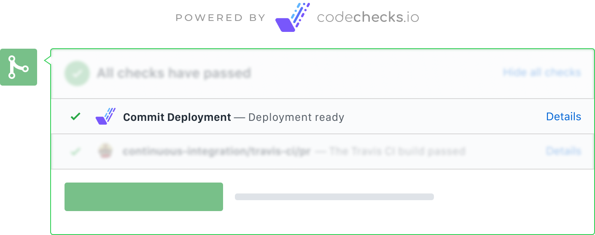

<p align="center">
  
  <h3 align="center">Commit Deployment</h3>
  <p align="center">Ship every code change that you make</p>

  <p align="center">
    <a href="https://circleci.com/gh/codechecks/commit-deployment"></a>
    <a href="/package.json"></a>
  </p>
</p>

## Install

```sh
npm add --save-dev @codechecks/commit-deployment
```

or

```sh
yarn add --dev @codechecks/commit-deployment
```

## Usage

Add to your `codechecks.yml` file:

```yml
checks:
  - name: commit-deployment
    options:
      buildPath: "./dist"
  # ...
```

With each pull request you will get a link do current deployment of your frontend app.

## API

### commitDeployment(options: Options): Promise\<void>

#### Options

```typescript
interface Options {
  buildPath: string;
  rootFile?: string; // defaults to index.html
  name?: string; // defaults to Commit Deployment
}
```

##### buildPath

`string`<br>\
Relative (to current codechecks file) path to build that is supposed to be deployed.

##### rootFile

optional `string`<br>\
Default: `index.html`<br>\
File considered as root in your build. Attached link will point directly to it.

##### name

optional `string`<br>\
Defaults: `Commit Deployment`<br>\
Specify the name for check. Might be useful in monorepos.

## Contributing

All contributions are welcomed. Read more in [CONTRIBUTING.md](./CONTRIBUTING.md)

## Licence

MIT @ [codechecks.io](https://codechecks.io)
